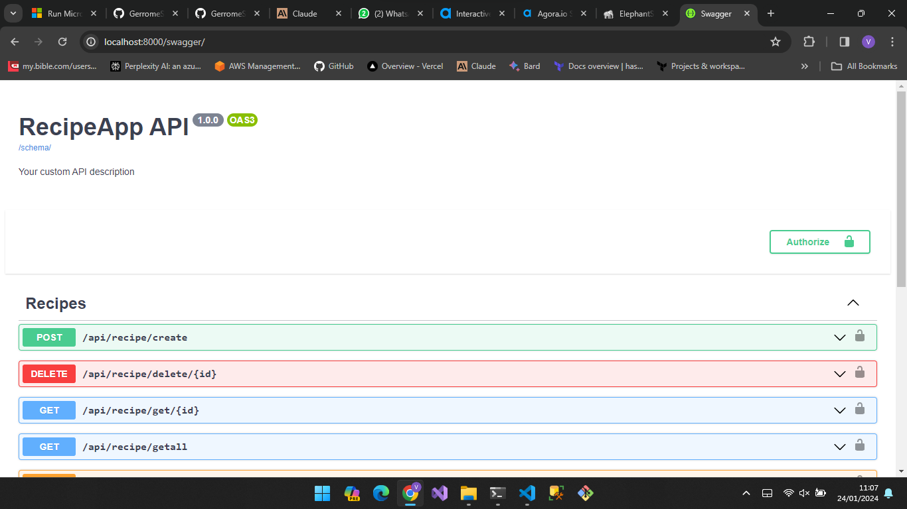

# Recipe App 

Recipe app is a Django web application to create, save and share food recipes.

## Features

- User authentication system with login/register
- JWT tokens for API authentication
- CRUD functionality for users
- CRUD functionality for recipes 
- Swagger/OpenAPI documentation for API

## Usage

### Install Dependencies

pip install -r requirements.txt

### Run Migrations

python manage.py migrate

### Run Development Server

python manage.py runserver

## API Documentation

Swagger API schema and documentation available at:

http://localhost:8000/swagger

